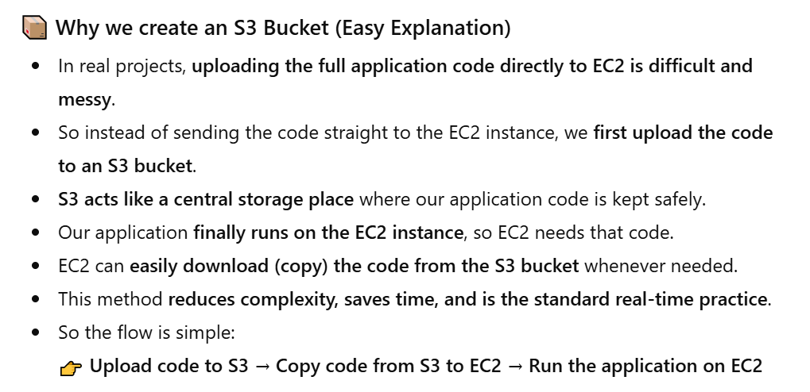
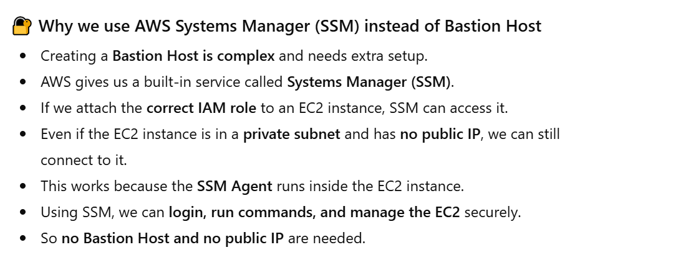
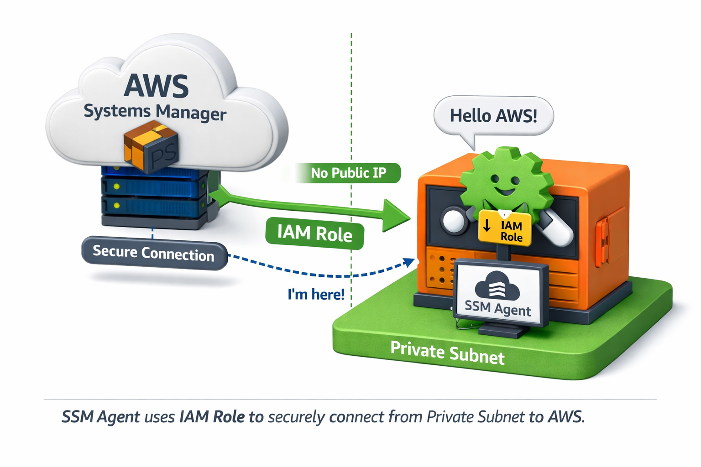

# 🚀 AWS 3 TIER ARCHITECTURE PROJECT 🌟
### In this project we are not going to use any devops tools , purely by using the services that are available in AWS.
## ARCHITECTURE 

😮 `Three Tier` means 3 layers for any applications that are running in real time scenarios they will be having 3 different layers before deploying the application into the server .
  ☺️ I have selected 2 AZs [AZ1 & AZ2] this is bcoz we need to maintain the application for `high availability` & `fault tolerance` the reason why i have spread my resources across AZ1 & AZ2 is even if the resources that are in AZ1 gets failed I don't want the end users to face any difficulty to access my application so that is the reason why i'm also going to spread my resources across the different AZ in my VPC Network .
  😏 If you want to give much higher availability to your application you can also spread your resources across multiple AZ based on the region that you are going to create.
  😮 In this project i am going to use `mumbai region` throughout the project & that's the same region that i am going to use, suppose if u want to use any other regions also u can use but make sure the region whichever u have selected should have atleast 2 AZ's bcoz in our case im going to spread the resources across 2 AZs. 
### 🔴 `WEB TIER`   The frontend of the application i am going to keep it in the public subnet the reason why i'm going to keep is `when end users wants to access the application they should be able to accessthe application` so that's the reason why i'm going to keep webtier in public subnet.
### 🔴 `APP TIER`   Here i have kept App Tier in Private Subnet reason is App Tier consists of the logic that is business logic which actually means the code of the application whatever code that is required to run our application i'm going to store that code into the apptier so usually `whenever you store the code in the EC2 instances u will never generally expose those instances to the public` so that's the reason why i'm going to keep the app tier inside the private subnets .
### 🔴 `DATABSE TIER`   Usually database we'll kept it in the private subnet the main reason is `we don't give the outsiders to access our databases` so that's the reason why i'm going to keep the private databse that we are going to create in the private subnet.
### 🔴 `LOAD BALANCER`   LB will distribute the traffic among the resources that are available.   `Based upon the traffic i'm going to monitor the CPU Utilization Capacity & then i'll be maintaining the EC2 instances to be up & running.`   *As a part of this project we are going to create 2 types of load balancers* 
- 1️⃣ External Load Balancer   This will be attached to the web type that is the instances that are available in the public subnet.
- 2️⃣ Internal Load Balancer   This i'm going to attach to the instances which are available in the private subnet that is app tier

The reason why i am creating External load balancer & Internal load balancer is the in the private subnets i have my instances running across 2 AZ if by any chance one of the EC2 Instance gets failed automatically a new instance should get created so that is the reason why i'm attaching the load balancer based upon the load balancer health check performance automatically it is going to create a new instances if the health check of any of the instances is not good ,similarly the external load balancer also performs the same thing the external load balancer we are going to attach it to the internet gateway 
### `The reason why i'm attaching internet gateway to the external load balancer is bcoz the outside public wants to access the application which is available in the web tier.` 
 We are also going to create a NAT Gateway
  In Database Tier if you want to maintain High Availability for your application usually we will select the databases as Multi-Availability zones or Multi AZs that means our databases should spread across different AZ
  In this project i am going to use free tier based RDS instance so that u will not be charged anything when you are practicing also but if you want High Availability to your RDS also u can select High Availability or High AZs for your RDS in the process of creating the RDS.
  🔗 Github Link https://github.com/Venkat474/3TierArchitectureApp.git

---

---

### 🔹 Steps for Setting Up the Project Infrastructure 🔹

1. VPC Creation
  Design and create a Virtual Private Cloud (VPC) to serve as the foundation for the project infrastructure.
  2. S3 Bucket and IAM Role Setup
  Create an S3 bucket and upload the application code.
  Set up an IAM role with the necessary permissions and attach it to the EC2 instance.
  3. Database Configuration
  Launch and configure an RDS instance to serve as the backend database.
  4. Application Tier Setup
  Deploy application-tier resources, including the configuration of an internal load balancer for traffic distribution within the tier.
  5. Web Tier Setup
  Provision web-tier resources and set up an external load balancer to manage incoming traffic from users.
  6. SSL Certification and Domain Mapping
  Generate an SSL certificate and apply it to the external load balancer to ensure secure communication.
  Map the domain name to the external load balancer for public accessibility.
---
# 🔹 1️⃣ VPC Creation 🔹
### `Go to AWS`
Go to VPC [ Region = Mumbai ap-south-1 ] 
  ➡️ Create VPC 
  ➡️ VPC & more [ i am going to create all at once so i am selecting this option ] 
  ➡️ Name tag = demo-vpc
  ➡️ IPV4 CIDR Block = 192.168.0.0/22 [ i will get 1024 IPs ] 
  ➡️ IPV6 CIDR Block = No IPV6 CIDR Block
  ➡️ Tenancy = Default [ If you selected Dedicated you will get charges ]
  ➡️ Number of Availability Zones[AZs] = 2
  ➡️ Number of Public Subnets = 2
  ➡️ Number of Private Subnets = 4
  ➡️ NAT Gateways = In 1 AZs [ only 1 NAT Gateway bcoz i need NAT Gateway in 1 AZ only,So whatever resources running in the private Subnets those resources need internet connectivity bcoz we need to download & install some packages. ]
  ➡️ VPC endpoints = none [ Here u can also use S3 service as End points but here it is not required ] 
  ➡️ Create VPC
### Once VPC gets created then we need to customize the subnet that is public subnets , private subnets & so on
Now we need to edit the subnet name [ by default we are getting the subnet name ] ➡️ Click on Subnets [ left side bar ] edit it as shown 

### We need to create 5 Security groups 
currently we have 2 Security groups , we are not going to use this bcoz we need to open the required ports we create our own  ➼  Click on Security groups [ left side bar ] edit it as shown

# 🔹 2️⃣ S3 Bucket and IAM Role Setup 🔹
The reason for creating the S3 Bucket is we need to upload the code into the S3 Bucket , 
  Bcoz in real time uploading the complete code into the EC2 Instances is a complex task & we don't do that generally 
  So if u want to copy all the data to the EC2 Instances where our application should run ultimately our application should run in the EC2 instances so i have to copy the data that is available in the S3 bucket to the EC2 Instance so for that reason to avoid the complexity of uploading the code into the EC2 Instances i'm going to upload the code into the S3 bucket & then i'm going to get the code from the S3 bucket into the EC2 Instance so that is what we are going to do.

- `Copy this Github repo` https://github.com/Venkat474/3TierArchitectureApp.git
- Go to any folder in your local system/create any new folder
- Go inside that folder click on `open git bash here` [ Why? Bcoz i going to download the code using git terminal ]
- git clone https://github.com/Venkat474/3TierArchitectureApp.git
- Go inside 3TierArchitectureApp we get 2 options .git & `application-code{Upload this entire folder into S3 bucket}`

#### `Go to S3`
- create bucket { Check region ➼ (Mumbai)ap-south-1 }
- General purpose
- name ➼ demo-3tier-project
- object ownership ➼ ACLs disabled
- create bucket {Now click on created bucket➼upload➼drag & drop `application-code` folder}

####  Create IAM setup
What is the reason for creating IAM Role?
  Bcoz , we have 2 EC2 Instances in the app Tier & these 2 instances are there in private subnet & database is also available in the private subnet so we cannot expose the resources which are there in the private subnet to the outsiders so for that what we need to do we don't want to expose so if you want to connect to the resources that is your EC2 Instances & the RDS Database which are there in the Private Subnet. We have 2 options
 1 . Either we have to create a `Baston host` which is the concept in VPC, we have to create a baston host in the public subnet and by using the baston host we should connect to the resources that are there in the private subnet.
 2 . Instead of creating the Baston host and complexing it ,In AWS we have a service which is called as `Systems manager` [ SSM ] so if we attach the appropriate role to the EC2 Instances which are there in the private subnets even though the virtual machines are there in the private subnets these EC2 Instances will not have the public IPs. So even though the virtual machines are in private subnets without any public IPs we can still connect to that VMs. how will we connect ,by using the SSM agent. 

**👉 The image shows that the SSM Agent inside an EC2 instance in a private subnet uses its IAM Role to securely connect to AWS Systems Manager, even without a public IP. ✅**
  Now the role i'm going to attach/the policy that i'm going to attach is `Amazon EC2 role for SSM`
  IAM Roles ➼ Roles { Left bar } ➼ create role ➼ 
  1. Aws Service ➼ use case ➼ EC2 ➼ next
  2. Permissions Policies ➼ AmazonEC2RoleforSSM ➼ Next
  3. Name ➼ Demo-EC2-Role ➼ Create role

# 🔹 3️⃣ Database Configuration 🔹 ( We are using a RDS Service )
`Go to RDS` ➼ Left side bar click on subnet group ➼ create DB subnet group ➼ Name = DB-SNGP ➼ 
  vpc = demo-vpc { this is our custom vpc , not default } ➼ 
  AZ = ap-south-1a , ap-south-1b  {we have 2 az in diagram , also see it is in mumbai region}
  subnets = demo-vpc-subnet-DB1-ap-south-1a , demo-vpc-subnet-DB2-ap-south-1b = create
#### Now we need to attach this created subnet group to the database that we are going to create that is RDS
Left side bar click on Databases ➼ create database 
  Choose a database creation method ➼ Standard create
  Engine type ➼ My SQL { we are selecting this bcoz it's free } 
  Edition ➼ MySQL community 
  Engine Version ➼ MYSQL 8.0.35
  Templates ➼ Free tier
  DB instance identifier ➼ database-1
  Master username ➼ admin
  credentials management ➼ self managed = give own password , re-type password
  Instance Configuration ➼ db.t4g.micro
  Storage ➼ General Purpose SSD (gp2) = 20GIB
  Connectivity ➼ Don't connect to an EC2 compute resource = IPV4
  VPC ➼ Custom [demo-vpc]
  DB ➼ Subnet group ➼ db-sngp
  Public access ➼ No
  VPC security group ➼ choose existing ➼ RDS-SG {select this remove default one}
  AZ ➼ No preference
  RDS Proxy ➼ ❌ don't need
  Certificate authority ➼ default
  Database authentication ➼ password authentication
  Monitoring ➼ ❌
  Additional Configuration = name ➼ ❌ = default: mysql8.0
  Backup ➼ 🔲 Don't tick this
  AWS KMS key ➼ aws/rds (default)
  🔲{don't tick this} Enable auto minor version upgrade
  Maintenance window ➼ No preference ➼ create database
  `Go to EC2` ➼ see region(Mumbai) ➼ Launch Instance ➼ Name = AppTierInstance
  Quick start ➼ Linux aws
  AMI ➼ Amazon Linux 2 AMI(HVM)-Kernels.10,SSD VolumeType[Free tier]
  Instance type ➼ t2.micro
  Key Pair ➼ proceed without a key pair
  Network settings ➼ edit ➼ VPC = [demo-vpc] ➼ subnet = demo-vpc-subnet-App1-ap-south-1a
  Auto = assign publicIP = Disable
  Firewall ➼ select existing security group [ App-SG ]
  configure storage ➼ 8GIB gp2 Root Volume
  Advanced details ➼ IAM instance profile = Demo-EC2-Role ➼ Launch Instance ➼ connect ➼ Session manager ➼ connect
# 🔹 4️⃣ Creation of App Tier Resources 🔹 
###  4️⃣.1️⃣ **In this instance we will do the App Server Setup and DB Server Configuration. Executing the below commands;**
   👉 `sh-4.2$ sudo su`
   👉 `[root@ip-192-168-2-27 bin]# cd..`
   👉 `[root@ip-192-168-2-27 usr]# cd /home/ec2-user/`
   👉 `[root@ip-192-168-2-27 ec2-user]# ping 8.8.8.8` {If it works it means internet is coming to your instances, Ctrl+C to come out of it}
   👉 `[root@ip-192-168-2-27 ec2-user]# sudo yum install mysql -y` &nbsp;&nbsp;&nbsp;&nbsp;&nbsp;&nbsp;&nbsp;&nbsp;  { Install mysql }
  **Configure MySQL Database**
  Connect to the database and perform basic configuration: Replace below info with your DB information
  `mysql -h <DB EndPoint> -u admin -p` ----> Enter the Password i.e kastro2025 (this is DB password). If you couldn't connect, there is a problem with the SG of the DB.
&nbsp;&nbsp;&nbsp;&nbsp;&nbsp;&nbsp;&nbsp;&nbsp;  **`Ex: mysql -h database-1.c380a08uukyc.ap-south-1.rds.amazonaws.com -u admin -p`**
   👉 `[root@ip-192-168-2-27 ec2-user]# mysql -h database-1.c380a08uukyc.ap-south-1.rds.amazonaws.com -u admin -p` &nbsp;&nbsp;&nbsp;&nbsp;&nbsp;&nbsp;&nbsp;&nbsp; {Give password }
  **Lets create a database.** The database name i'm creating is `"webappdb"` (This is same name that you should give in DvConfig.js file);
   👉 `MYSQL [ (none) ] > CREATE DATABASE webappdb;`
   👉 `MYSQL [ (none) ] > SHOW DATABASES;` 
   👉 `MYSQL [ (none) ] > USE webappdb;` &nbsp;&nbsp;&nbsp;&nbsp;&nbsp;&nbsp;&nbsp;&nbsp; { You will see 'Database changed' }
  **Execute the below code as a single code. Here we are creating a table with the name `'transactions'`**
   👉 `MYSQL [ (webappdb) ] > CREATE TABLE IF NOT EXISTS transactions(`
  &nbsp;&nbsp;&nbsp;&nbsp;&nbsp;&nbsp;&nbsp;&nbsp;  `id INT NOT NULL AUTO_INCREMENT,` 
  &nbsp;&nbsp;&nbsp;&nbsp;&nbsp;&nbsp;&nbsp;&nbsp;  `amount DECIMAL(10,2),` 
  &nbsp;&nbsp;&nbsp;&nbsp;&nbsp;&nbsp;&nbsp;&nbsp;  `description VARCHAR(100),` 
  &nbsp;&nbsp;&nbsp;&nbsp;&nbsp;&nbsp;&nbsp;&nbsp;  `PRIMARY KEY(id)`
  `);`
   👉 `MYSQL [ (webappdb) ] > SHOW TABLES;` &nbsp;&nbsp;&nbsp;&nbsp;&nbsp;&nbsp;&nbsp;&nbsp; {To verify whether table got created or not;}
  **Lets insert some info into the table**
   👉 `MYSQL [ (webappdb) ] >INSERT INTO transactions (amount, description) VALUES ('400', 'groceries');` &nbsp;&nbsp;&nbsp;&nbsp;&nbsp;&nbsp;&nbsp;&nbsp; {transactions represents table name}
  **To verify whether the entry is really created or not**
  👉 `MYSQL [ (webappdb) ] > SELECT * FROM transactions;` &nbsp;&nbsp;&nbsp;&nbsp;&nbsp;&nbsp;&nbsp;&nbsp; {You will see the info you have written}
  Till now what we are doing is we are entering the data from the instance directly into the database we are entering but this is not my real time scenerio , in real time what will happen is when application is open to public users will enter the data whenever users will enter the data you will able to see the data here in the database but currenlty i have shown the how to create enteries inside the database . 
  If u want to summarize this ,From app server i am able to connect to my database server and i am able to write some information inside the database server like amount and groceries etc., now here we have connected private instance in private subnet of apptier & database instance which is there in the database tier remember database tier is not required to be connected with the app tier 
  **To come out of the DB;**
  👉 `MYSQL [ (webappdb) ] > exit` (You will see 'ec2-user' at the end of command line and at the beginning of command line you will see 'root')

**Go into the following path of cloned code `"application-code/app-tier/DbConfig.js"` and open `'Dbconfig.js'` file and change the things accordingly as shown below;**
  module.exports = Object.freeze({
 &nbsp;&nbsp;&nbsp;&nbsp;&nbsp;&nbsp;&nbsp;&nbsp;   DB_HOST: 'YOUR-DATABASE-ENDPOINT.ap-south-1.rds.amazonaws.com',
 &nbsp;&nbsp;&nbsp;&nbsp;&nbsp;&nbsp;&nbsp;&nbsp;   DB_USER: 'admin',
 &nbsp;&nbsp;&nbsp;&nbsp;&nbsp;&nbsp;&nbsp;&nbsp;   DB_PWD: 'kastro2025',
 &nbsp;&nbsp;&nbsp;&nbsp;&nbsp;&nbsp;&nbsp;&nbsp;   DB_DATABASE: 'webappdb'
 });
 The reason for having the above info is our App Servers running in Private Subnets should be able to connect to the DB, for that connectivity it is going to use these credentials provided in DbConfig.js file. 
  **Update the above code and upload the Dbconfig.js file in the S3 bucket of 'app-tier' folder.**
  `Go to S3` ➼ Go to this path `application-code/app-tier` ➼ click on upload {automatically it gets replace to new} ➼ Drag and Drop ➼ upload 
  **Install and Configure Node.js and PM2** {Bcoz we are working with the nodejs application) 
   👉 `[root@ip-192-168-2-27 ec2-user]# curl -o- https://raw.githubusercontent.com/avizway1/aws_3tier_architecture/main/install.sh | bash`
   👉 `[root@ip-192-168-2-27 ec2-user]# source ~/.bashrc`
   👉 `[root@ip-192-168-2-27 ec2-user]# nvm install 16` &nbsp;&nbsp;&nbsp;&nbsp;&nbsp;&nbsp;&nbsp;&nbsp; { Node Version Manager (for managing Node.js versions) }
   👉 `[root@ip-192-168-2-27 ec2-user]# nvm use 16` &nbsp;&nbsp;&nbsp;&nbsp;&nbsp;&nbsp;&nbsp;&nbsp; { You will see 'Now using node v16.20.2 }
  **Now we need to run node as a service, we will install pm2**
   👉 `[root@ip-192-168-2-27 ec2-user]# npm install -g pm2` &nbsp;&nbsp;&nbsp;&nbsp;&nbsp;&nbsp;&nbsp;&nbsp; {You will see 'found 0 vulnerabilities}
   👉 `[root@ip-192-168-2-27 ec2-user]# pwd` &nbsp;&nbsp;&nbsp;&nbsp;&nbsp;&nbsp;&nbsp;&nbsp;  { /home/ec2-user }
   👉 `[root@ip-192-168-2-27 ec2-user]# cd ..`
   👉 `[root@ip-192-168-2-27 home]# cd ..`
   👉 `[root@ip-192-168-2-27 /]# cd ~/`
   👉 `[root@ip-192-168-2-27 ~]# `
  **Now we need to copy the code that is available in the s3 bucket to EC2 Instance `OR` Download application code from S3 and start the application**
  Ex:- sudo aws s3 cp s3://<S3BucketName>/application-code/app-tier/ app-tier --recursive
   👉 `[root@ip-192-168-2-27 ~]# sudo aws s3 cp s3://demo-3tier-project/application-code/app-tier/ app-tier --recursive`
   👉 `[root@ip-192-168-2-27 ~]# ls` &nbsp;&nbsp;&nbsp;&nbsp;&nbsp;&nbsp;&nbsp;&nbsp;  { You will see 'app-tier' folder }
   👉 `[root@ip-192-168-2-27 ~]# cd app-tier/`
   👉 `[root@ip-192-168-2-27 app-tier]# npm install`  &nbsp;&nbsp;&nbsp;&nbsp;&nbsp;&nbsp;&nbsp;&nbsp;  { Node Package Manager (CLI) used to install packages }
   👉 `[root@ip-192-168-2-27 app-tier]# ls`  &nbsp;&nbsp;&nbsp;&nbsp;&nbsp;&nbsp;&nbsp;&nbsp; {You will see 'index.js' file. We have to start that}
   👉 `[root@ip-192-168-2-27 app-tier]# pm2 start index.js` &nbsp;&nbsp;&nbsp;&nbsp;&nbsp;&nbsp;&nbsp;&nbsp;  {You will see the status as 'online'}
   👉 `[root@ip-192-168-2-27 app-tier]# pm2 status` &nbsp;&nbsp;&nbsp;&nbsp;&nbsp;&nbsp;&nbsp;&nbsp; {To verify: ➼ pm2 list (or) pm2 status }
   👉 `[root@ip-192-168-2-27 app-tier]# pm2 logs` &nbsp;&nbsp;&nbsp;&nbsp;&nbsp;&nbsp;&nbsp;&nbsp; {You will not see anything in red colour, everything in white colour you should see , To come out CTRL + C ,At the end you will see something like ➼ http://localhost:4000 but if u open this it will not work right now}
   👉 `[root@ip-192-168-2-27 app-tier]# pm2 save`  &nbsp;&nbsp;&nbsp;&nbsp;&nbsp;&nbsp;&nbsp;&nbsp; { To save the configuration }	
  **Verify that the application is running by executing**
   👉 `[root@ip-192-168-2-27 app-tier]# curl http://localhost:4000/health` { It should return: This is the health check. }
  **With this we have completed the application configuration.**

### 4️⃣.2️⃣ Creation of Internal Load Balancer for App Tier
First we need to create the target groups and then we need to attach this target group to the internal load balancer ,so firstly we will create the internal load balancer & we will update the nginx configuration with internal load balancer DNS name , by using the DNS name of the internal load balancer we are going to update the nginx configuration , Nginx is a web server just like tomcat here we are going to use nginx for this project
  **`Go to EC2`** 
  **Go to Target Groups** at left side bar ➼ create target groups 
  Basic configuration ➼ Instances
  Target group name ➼ App-Internal-TG 
  Port ➼ Http = 4000
  IP Address ➼ IPV4
  VPC ➼ demo-vpc
  Protocol version ➼ HTTP1
  Health checks protocol ➼ HTTP = Health check path ➼ /health ➼ Next
  It will ask which instance u are going to register for this target groups? `Select AppTierInstance` ➼ click on Include as pending below ➼ createTargetGroup
  **Go to Load Balancers** at left bar ➼ create load balancer 
  Load Balancer type ➼ Application load balancer (create) ➼ Load balancer name = App-Internal-LB
  Scheme ➼ Internal
  Load balancer IP Address ➼ IPV4
  VPC ➼ demo-vpc
  AZ➼`ap-south-1a(aps1-az1)` subnet=`demo-vpc-subnet-App1-ap-south-1a`,`ap-south-1b(aps1-az3)` subnet=`demo-vpc-subnet-App2-ap-south-1b`
  Security groups ➼ Internal-ALB-SG { remove default }
  Listeners and routing ➼ Protocol = HTTP ➼ Port = 80 ➼ Default action = App-Internal-TG ➼ create load balancer 
  Now we have got the DNS name , we are going to configure it in the Nginx file `application-code/nginx.conf` 
  **Goto the downloaded code folder in local system ----> Open nginx.conf file and in the end of the file you will see something like below;**
  &nbsp;&nbsp;&nbsp;&nbsp;&nbsp;&nbsp;&nbsp;&nbsp;       #proxy for internal lb
  &nbsp;&nbsp;&nbsp;&nbsp;&nbsp;&nbsp;&nbsp;&nbsp;       location /api/{
  &nbsp;&nbsp;&nbsp;&nbsp;&nbsp;&nbsp;&nbsp;&nbsp;               proxy_pass http://[REPLACE-WITH-INTERNAL-LB-DNS]:80/;
  &nbsp;&nbsp;&nbsp;&nbsp;&nbsp;&nbsp;&nbsp;&nbsp;       }
  **Replace the LB DNS in the above** Ex:➼ proxy_pass http://internal-App-Internal-LB-2141813828.ap-south-1.elb.amazonaws.com:80/;
  Upload the updated nginx.conf file to the S3 bucket
  **Update the above code and upload the nginx.conf file in the S3 bucket of 'application-code' folder.**
  `Go to S3` ➼ Go to this path `application-code/` ➼ click on upload {automatically it gets replace to new} ➼ Drag and Drop ➼ upload 
# 🔹 5️⃣ Creation of Web tier setup 🔹  resources including External Load Balancer  
**`Go to EC2`** = Launch Instance  
  = name ➼ Web-Tier-Instance  
  = Quick start ➼ Amazon linux 
  = AMI ➼ Amazon Linux 2 AMI (HVM) - kernel 5.10,SSD Volume Type {Free Tier Eligible} 
  = Instance type ➼ t2.micro 
  = Key pair ➼ Proceed without a key pair 
  = Network settings ➼ edit = VPC = demo-vpc = subnet = demo-vpc-subnet-public1-ap-south-1a 
  = Auto-assign public IP ➼ Enable
  = Firewall ➼ Select existing security group ➼ Web-SG
  = Advanced details ➼ IAM = Demo-EC2-Role ➼ Launch Instance ➼ Connect ➼ Session Manager ➼ Connect
   👉 `sh-4.2$ sudo -su ec2-user` &nbsp;&nbsp;&nbsp;&nbsp;&nbsp;&nbsp;&nbsp;&nbsp; { To work as an ec2-user } 
   👉 `[ec2-user@ip-192-168-0-38 bin]$ cd /home/ec2-user`
   👉 `[ec2-user@ip-192-168-0-38 ~]$ curl -o- https://raw.githubusercontent.com/avizway1/aws_3tier_architecture/main/install.sh | bash `
   👉 `[ec2-user@ip-192-168-0-38 ~]$ source ~/.bashrc`
   👉 `[ec2-user@ip-192-168-0-38 ~]$ nvm install 16`
   👉 `[ec2-user@ip-192-168-0-38 ~]$ nvm use 16`
**EX:➼ aws s3 cp s3://<S3 Bucker Name>/application-code/web-tier/ web-tier --recursive**
   👉 `[ec2-user@ip-192-168-0-38 ~]$ aws s3 cp s3://demo-3tier-project/application-code/web-tier/ web-tier --recursive`
   👉 `[ec2-user@ip-192-168-0-38 ~]$ ls` { You will see 'web-tier' }
   👉 `[ec2-user@ip-192-168-0-38 ~]$ cd web-tier`
   👉 `[ec2-user@ip-192-168-0-38 web-tier]$ npm install`
   👉 `[ec2-user@ip-192-168-0-38 web-tier]$ npm run build`
   👉 `[ec2-user@ip-192-168-0-38 web-tier]$ sudo amazon-linux-extras install nginx1 -y` &nbsp;&nbsp;&nbsp;&nbsp;&nbsp;&nbsp;&nbsp;&nbsp; { To install nginx }
**Update Nginx configuration:**
   👉 `[ec2-user@ip-192-168-0-38 web-tier]$ cd /etc/nginx` &nbsp;&nbsp;&nbsp;&nbsp;&nbsp;&nbsp;&nbsp;&nbsp; { Your are in nginx path }
   👉 `[ec2-user@ip-192-168-0-38 nginx]$ ls` &nbsp;&nbsp;&nbsp;&nbsp;&nbsp;&nbsp;&nbsp;&nbsp; { You will see 'nginx.conf' file }
**We need to remove this nginx.conf file bcoz this was not updated one**
   👉 `[ec2-user@ip-192-168-0-38 nginx]$ sudo rm nginx.conf`
**EX:➼ sudo aws s3 cp s3://<S3 Bucker Name>/application-code/nginx.conf**
   👉 `[ec2-user@ip-192-168-0-38 nginx]$ sudo aws s3 cp s3://demo-3tier-project/application-code/nginx.conf `
   👉 `[ec2-user@ip-192-168-0-38 nginx]$ sudo service nginx restart`
   👉 `[ec2-user@ip-192-168-0-38 nginx]$ chmod -R 755 /home/ec2-user`
   👉 `[ec2-user@ip-192-168-0-38 nginx]$ sudo chkconfig nginx on`
  To check the output of the App, we can check using the Web-Tier-Instance public IP. 
  { In Web-Tier-Instance } But before checking lets open port no 80 Go to Security ➼ Security groups ➼ Edit inbound rules ➼ Add rule ➼  http ➼ Anywhere IPv4 ➼ 0.0.0.0/0 ➼ Save rules ➼ Now paste the pubic ip of Web-Tier-Instance in new tab of browser ----> You will see the app ----> Enter the data in the app
  **We need to create a custom domain using route 53 we should not give public ip or dns to anyone**
In Real time we are not going to deliver the applications using the public IP Address then what we need to do is we need to create the external load balancer 
we are not going to give the DNS name of the external load balancer to the end users we need to map the DNS name to the load balancer to the Route53 custom domain 
Firstly we need to create the security group then we need to create the ELB { we also call as internet facing load balancer }
**`Go to target groups`** ➼ Create target group ➼ 
Basic configuration  ➼ instances
Target group name  ➼ External-Web-TG
Port  ➼ HTTP , 80
VPC  ➼ demo-vpc
Protocol version  ➼ HTTP1
Health check protocol  ➼ HTTP 
Health check path  ➼ /  ➼ next
tick Web-Tier-Instance  ➼ include as pending below  ➼ create target group
Now we need to create load balancer and we need to attach this target group 
**`Go to load balancers`**  ➼ create load balancer  ➼ 
load balancer  ➼ Application load balancer
Name  ➼ External-Web-ALB
scheme  ➼ internet facing
load balancer IP Address  ➼ IPV4
Network mapping  ➼ demo-vpc { select this one }
  AZ➼`ap-south-1a(aps1-az1)` subnet=`demo-vpc-subnet-public1-ap-south-1a`,`ap-south-1b(aps1-az3)` subnet=`demo-vpc-subnet-public2-ap-south-1b`
  Security groups ➼ Web-ALB-SG { remove default }
  Listeners and routing ➼ Protocol = HTTP ➼ Port = 80 ➼ Default action = External-Web-TG ➼ create load balancer 
Now we will create the certificate manager service in AWS , now we need to route the traffic to custom domain 
### Purchasing domain using Route53
`Go to Route53` ➼ 
choose your starting point ➼ Register a domain ➼ Get started ➼ Search for domain = learnwithvenkat.com ➼ proceed to checkout {auto renew off} ➼ next ➼ contact information  ➼ next ➼ review & submit 
