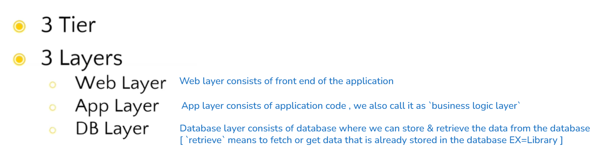
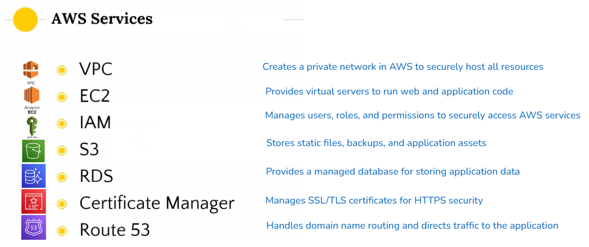
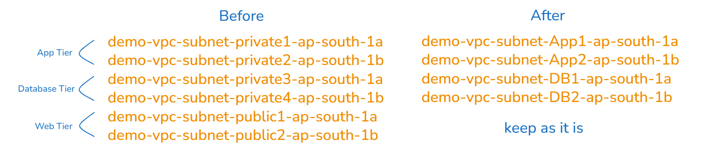
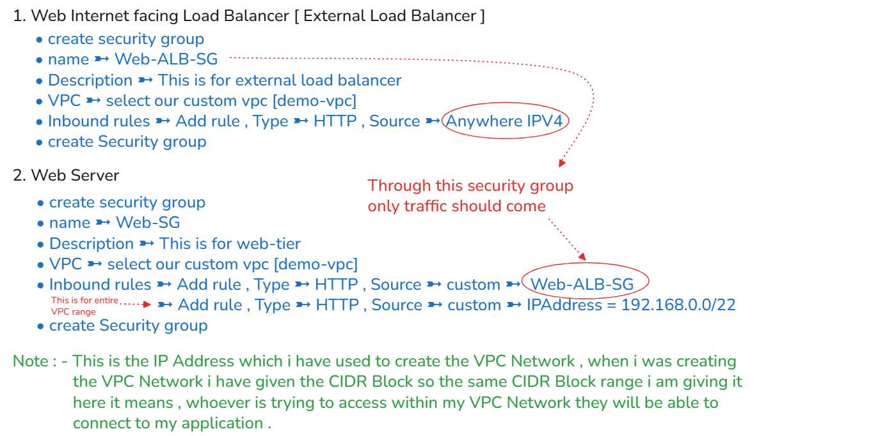
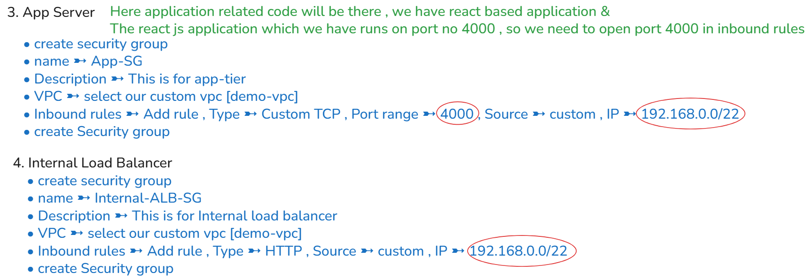
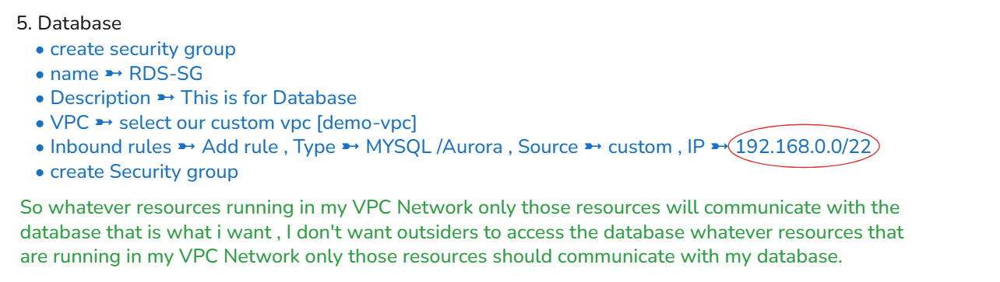

# 🚀 AWS 3 TIER ARCHITECTURE PROJECT 🌟
### In this project we are not going to use any devops tools , purely by using the services that are available in AWS.
## ARCHITECTURE 

😮 `Three Tier` means 3 layers for any applications that are running in real time scenarios they will be having 3 different layers before deploying the application into the server .
  ☺️ I have selected 2 AZs [AZ1 & AZ2] this is bcoz we need to maintain the application for `high availability` & `fault tolerance` the reason why i have spread my resources across AZ1 & AZ2 is even if the resources that are in AZ1 gets failed I don't want the end users to face any difficulty to access my application so that is the reason why i'm also going to spread my resources across the different AZ in my VPC Network .
  😏 If you want to give much higher availability to your application you can also spread your resources across multiple AZ based on the region that you are going to create.
  😮 In this project i am going to use `mumbai region` throughout the project & that's the same region that i am going to use, suppose if u want to use any other regions also u can use but make sure the region whichever u have selected should have atleast 2 AZ's bcoz in our case im going to spread the resources across 2 AZs. 
### 🔴 `WEB TIER`   The frontend of the application i am going to keep it in the public subnet the reason why i'm going to keep is `when end users wants to access the application they should be able to accessthe application` so that's the reason why i'm going to keep webtier in public subnet.
### 🔴 `APP TIER`   Here i have kept App Tier in Private Subnet reason is App Tier consists of the logic that is business logic which actually means the code of the application whatever code that is required to run our application i'm going to store that code into the apptier so usually `whenever you store the code in the EC2 instances u will never generally expose those instances to the public` so that's the reason why i'm going to keep the app tier inside the private subnets .
### 🔴 `DATABSE TIER`   Usually database we'll kept it in the private subnet the main reason is `we don't give the outsiders to access our databases` so that's the reason why i'm going to keep the private databse that we are going to create in the private subnet.
### 🔴 `LOAD BALANCER`   LB will distribute the traffic among the resources that are available.   `Based upon the traffic i'm going to monitor the CPU Utilization Capacity & then i'll be maintaining the EC2 instances to be up & running.`   *As a part of this project we are going to create 2 types of load balancers* 
- 1️⃣ External Load Balancer   This will be attached to the web type that is the instances that are available in the public subnet.
- 2️⃣ Internal Load Balancer   This i'm going to attach to the instances which are available in the private subnet that is app tier

The reason why i am creating External load balancer & Internal load balancer is the in the private subnets i have my instances running across 2 AZ if by any chance one of the EC2 Instance gets failed automatically a new instance should get created so that is the reason why i'm attaching the load balancer based upon the load balancer health check performance automatically it is going to create a new instances if the health check of any of the instances is not good ,similarly the external load balancer also performs the same thing the external load balancer we are going to attach it to the internet gateway 
### `The reason why i'm attaching internet gateway to the external load balancer is bcoz the outside public wants to access the application which is available in the web tier.` 
 We are also going to create a NAT Gateway
  In Database Tier if you want to maintain High Availability for your application usually we will select the databases as Multi-Availability zones or Multi AZs that means our databases should spread across different AZ
  In this project i am going to use free tier based RDS instance so that u will not be charged anything when you are practicing also but if you want High Availability to your RDS also u can select High Availability or High AZs for your RDS in the process of creating the RDS.
  🔗 Github Link https://github.com/Venkat474/3TierArchitectureApp.git

---

---

### 🔹 Steps for Setting Up the Project Infrastructure 🔹
1. VPC Creation
  Design and create a Virtual Private Cloud (VPC) to serve as the foundation for the project infrastructure.
  2. S3 Bucket and IAM Role Setup
  Create an S3 bucket and upload the application code.
  Set up an IAM role with the necessary permissions and attach it to the EC2 instance.
  3. Database Configuration
  Launch and configure an RDS instance to serve as the backend database.
  4. Application Tier Setup
  Deploy application-tier resources, including the configuration of an internal load balancer for traffic distribution within the tier.
  5. Web Tier Setup
  Provision web-tier resources and set up an external load balancer to manage incoming traffic from users.
  6. SSL Certification and Domain Mapping
  Generate an SSL certificate and apply it to the external load balancer to ensure secure communication.
  Map the domain name to the external load balancer for public accessibility.
---
# 🔹 1️⃣ VPC Creation 🔹
### `Go to AWS`
Go to VPC [ Region = Mumbai ap-south-1 ] 
  ➡️ Create VPC 
  ➡️ VPC & more [ i am going to create all at once so i am selecting this option ] 
  ➡️ Name tag = demo-vpc
  ➡️ IPV4 CIDR Block = 192.168.0.0/22 [ i will get 1024 IPs ] 
  ➡️ IPV6 CIDR Block = No IPV6 CIDR Block
  ➡️ Tenancy = Default [ If you selected Dedicated you will get charges ]
  ➡️ Number of Availability Zones[AZs] = 2
  ➡️ Number of Public Subnets = 2
  ➡️ Number of Private Subnets = 4
  ➡️ NAT Gateways = In 1 AZs [ only 1 NAT Gateway bcoz i need NAT Gateway in 1 AZ only,So whatever resources running in the private Subnets those resources need internet connectivity bcoz we need to download & install some packages. ]
  ➡️ VPC endpoints = none [ Here u can also use S3 service as End points but here it is not required ] 
  ➡️ Create VPC
### Once VPC gets created then we need to customize the subnet that is public subnets , private subnets & so on
Now we need to edit the subnet name [ by default we are getting the subnet name ] ➡️ Click on Subnets [ left side bar ] edit it as shown 

### We need to create 5 Security groups 
currently we have 2 Security groups , we are not going to use this bcoz we need to open the required ports we create our own  ➼  Click on Security groups [ left side bar ] edit it as shown

# 🔹 2️⃣ S3 Bucket and IAM Role Setup 🔹
The reason for creating the S3 Bucket is we need to upload the code into the S3 Bucket , 
  Bcoz in real time uploading the complete code into the EC2 Instances is a complex task & we don't do that generally 
  So if u want to copy all the data to the EC2 Instances where our application should run ultimately our application should run in the EC2 instances so i have to copy the data that is available in the S3 bucket to the EC2 Instance so for that reason to avoid the complexity of uploading the code into the EC2 Instances i'm going to upload the code into the S3 bucket & then i'm going to get the code from the S3 bucket into the EC2 Instance so that is what we are going to do.
